# Essenza Bistro

Plataforma full-stack para operacao interna de restaurante e atendimento publico, com arquitetura em microfrontends, backend modular e deploy em nuvem.

## Producao

- Painel interno: `https://microfrontends-cardapio-pvda.vercel.app`
- Microfrontend de comandas (remote): `https://microfrontends-cardapio-3lty.vercel.app`
- Site publico: `https://microfrontends-cardapio.vercel.app`
- Backend (health): `https://microfrontends-cardapio-production.up.railway.app/api/health`
- Repositorio: `https://github.com/Luanagroth/microfrontends-cardapio`

## Objetivo do projeto

- Centralizar a operacao diaria do restaurante em um painel unico.
- Entregar uma experiencia publica moderna para reservas, cardapio e curriculos.
- Integrar ambos os lados com a mesma API e mesma base de dados.
- Demonstrar arquitetura escalavel com microfrontends e deploy real em producao.

## Sistema de gestao interna x site publico

Este projeto foi implementado como um ecossistema com duas entradas principais:

- **Sistema de gestao interna (backoffice)** para uso da operacao do restaurante.
- **Site publico** para uso de clientes e candidatos.

### O que e operado no sistema interno

O painel interno possui areas editaveis e operacionais para:

- **Reservas**: acompanhamento de ativas, pendentes, confirmadas e historico.
- **Comandas**: abertura, preenchimento de itens, descontos, pagamento e fechamento.
- **Cardapio**: criacao/edicao de produtos, categorias, disponibilidade e imagens.
- **Curriculos**: triagem de candidaturas recebidas pelo site publico.
- **Relatorios**: consolidacao gerencial com exportacao em PDF.

### O que entra pelo site publico

O site publico recebe:

- **Novas reservas**
- **Envio de curriculos em PDF**

Essas entradas sao enviadas para o backend e aparecem automaticamente no sistema interno.

### Integracao entre as duas frentes

- Reservas e curriculos criados no site publico sao refletidos no painel interno.
- O cardapio exibido no site publico e controlado pelo modulo de **gestao de cardapio** do sistema interno.
- As comandas sao preenchidas no sistema interno com base no cardapio atual salvo no backend.
- Toda atualizacao ocorre pela API central, mantendo os dois lados sincronizados.

## Preview

### Sistema interno

1. Login administrativo  
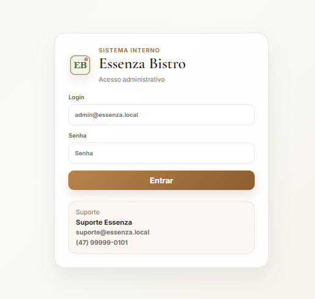

2. Painel geral  
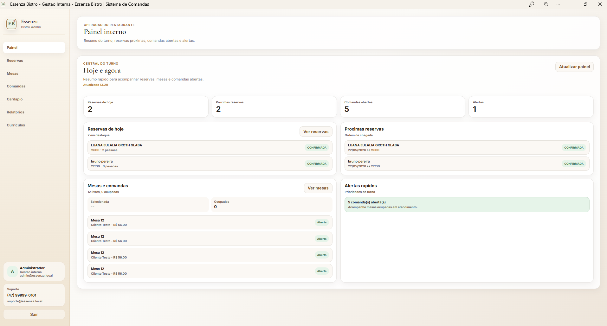

3. Mapa de mesas  
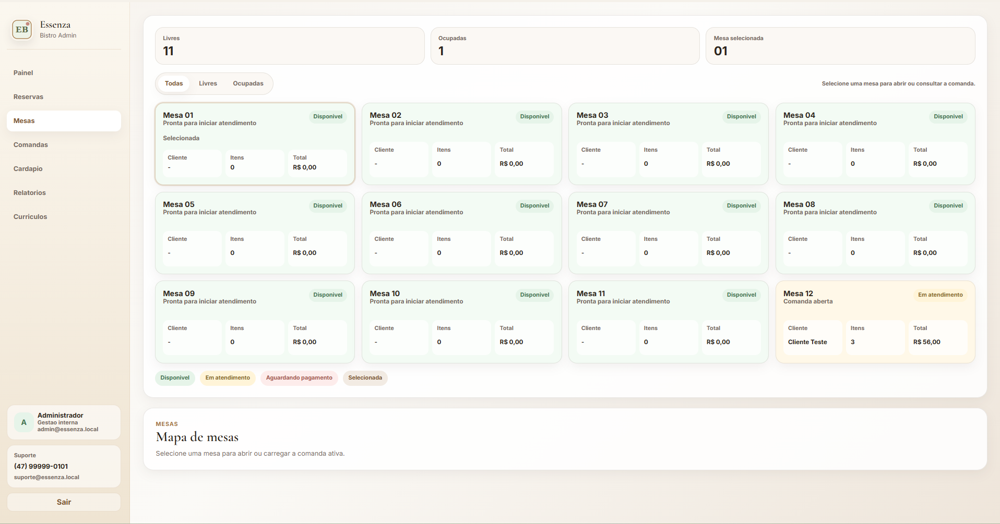

4. Comanda aberta  
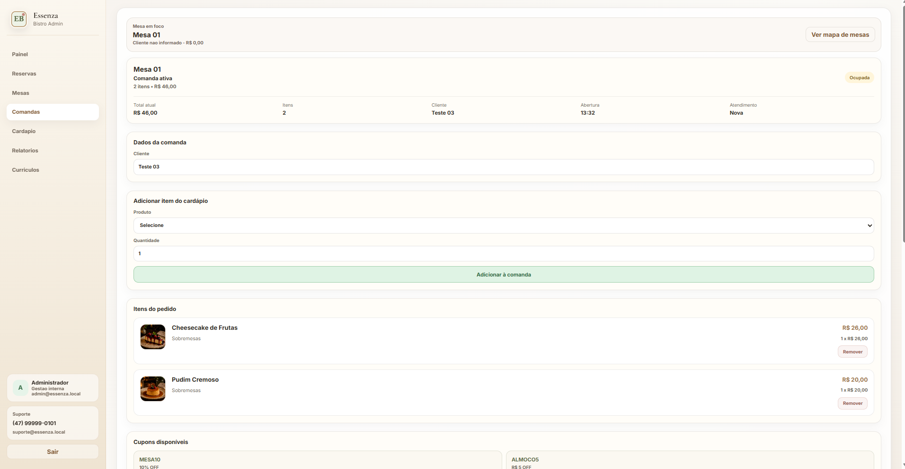

5. Comanda (pagamento e fechamento)  
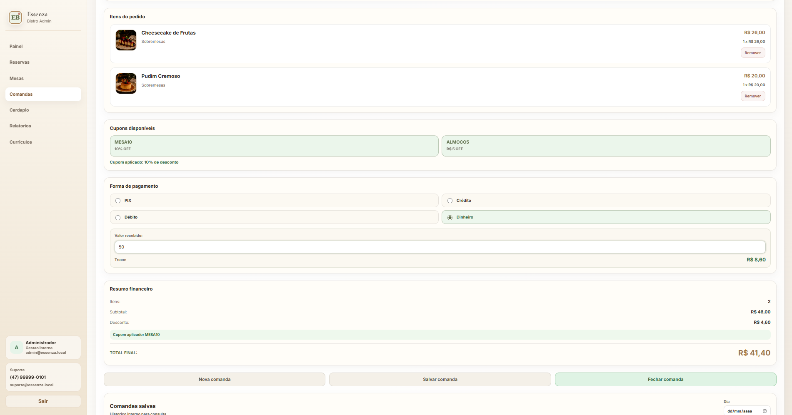

6. Gestao de cardapio  
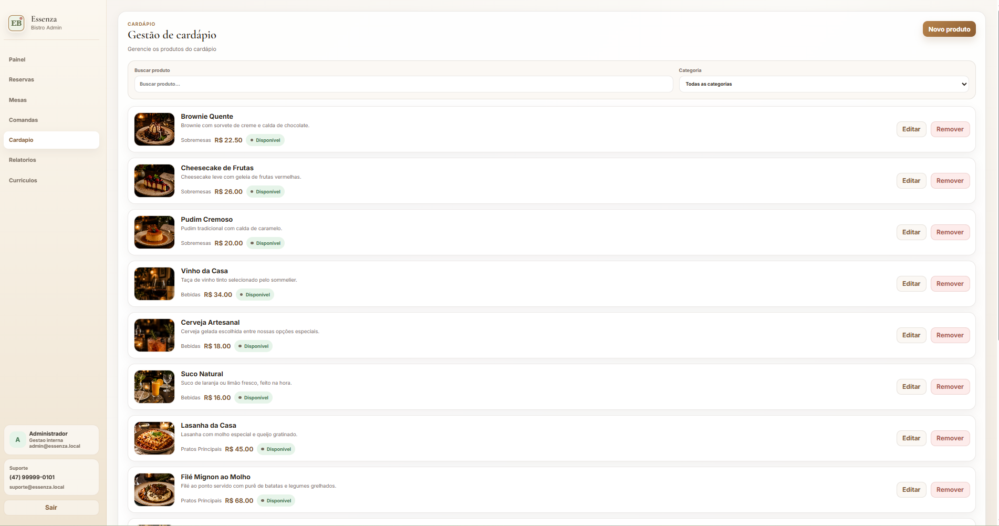

7. Relatorios  
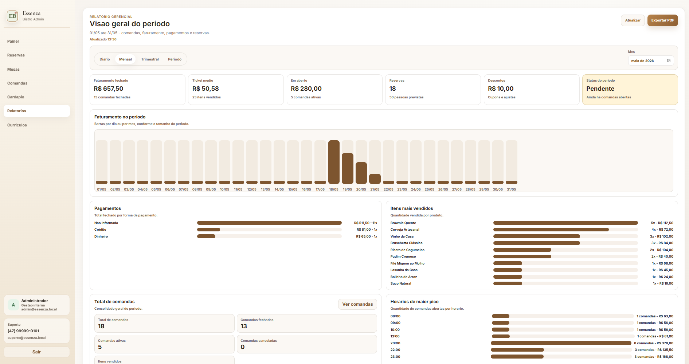

8. Curriculos recebidos  
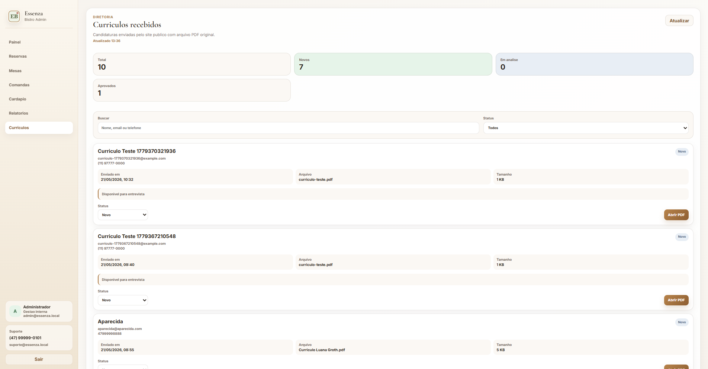

### Site publico

9. Home (primeira parte)  


10. Home (segunda parte)  
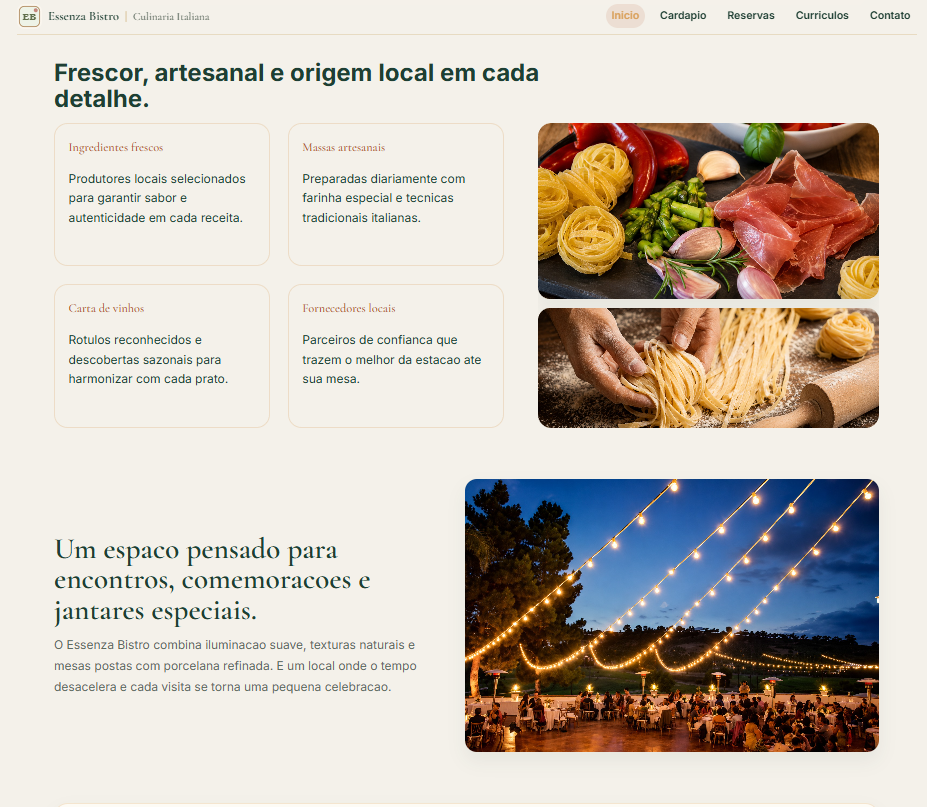

11. Reservas  
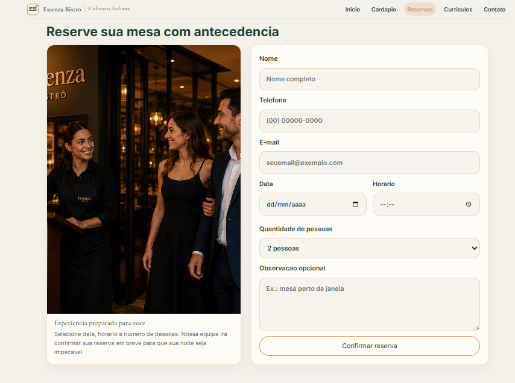

12. Curriculos e contato  
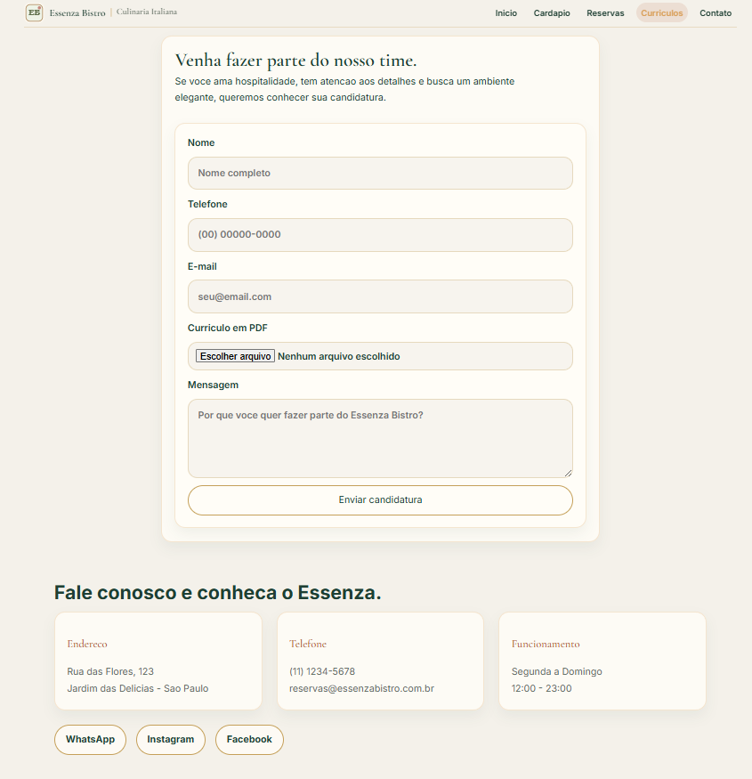

## Funcionalidades implementadas

- Login administrativo com perfil e bloco de suporte.
- Painel central com indicadores de turno, reservas e comandas.
- Mapa visual de mesas com status (disponivel, em atendimento, aguardando pagamento).
- Comandas com:
  - selecao de itens reais do cardapio
  - quantidade, subtotal e total
  - cupons e descontos
  - formas de pagamento e troco
  - historico de comandas salvas
- Gestao de cardapio com categorias, disponibilidade e imagens.
- Relatorios operacionais com filtros por periodo e exportacao em PDF.
- Historico de curriculos recebidos com visualizacao de PDF no painel interno.
- Site publico com:
  - cardapio
  - formulario de reservas
  - formulario de curriculos (PDF)
  - secao de contato

## Atualizacoes e desafios superados

- Reestruturacao de navegacao por paginas no painel interno.
- Ajustes de UX no fluxo de comandas e historicos.
- Integracao completa publico <-> interno via API unica.
- Correcao de CORS entre dominios Vercel (producao e preview).
- Correcao de fallback indevido para `localhost` em producao.
- Correcao de `404` de assets no build do frontend publico.
- Correcao de mixed content para imagens em ambiente HTTPS.
- Correcao de inicializacao de banco em producao no Railway.

## Stack tecnica

- React 18
- Webpack 5
- Module Federation
- Node.js
- Express
- Prisma ORM
- SQLite
- Multer
- Helmet
- Playwright
- Node test runner / testes unitarios por app
- Vercel (frontends)
- Railway (backend)
- GitHub (controle de versao e publicacao do codigo)

## Arquitetura do projeto

```text
microfrontends-cardapio/
  backend/                 # API, regras de negocio, prisma, uploads, testes
  container-app/           # Sistema interno (host)
  micro-pedido/            # Microfrontend de comandas (remote)
  public-client/           # Site publico
  shared/                  # Contratos e utilitarios compartilhados
  tests/                   # E2E (Playwright)
```

## Responsabilidades e organizacao (Clean Code / SOLID)

- Separacao por contexto de negocio no backend (`modules/*`).
- Fronteiras claras entre apps frontend.
- Reuso de contratos em `shared/` para reduzir duplicacao.
- Componentes e servicos com responsabilidade unica.
- Estrutura orientada a manutencao incremental e baixo acoplamento.

## Rodando localmente

Pre-requisitos:

- Node.js 18+ (recomendado 20+)
- npm 9+

Comandos:

```bash
npm install
npm run install:all

cd backend
npx prisma migrate deploy
npm run seed
cd ..

npm run start:all
```

Portas locais:

- `http://localhost:3000` (interno)
- `http://localhost:3002` (micro-pedido)
- `http://localhost:4000` (backend)
- `http://localhost:4001` (publico)

## Qualidade e testes

Comandos principais:

```bash
npm run test:all
npm run test:backend
npm run test:container
npm run test:pedido
npm run test:public
npm run test:e2e
```

## Deploy (Vercel + Railway)

- Frontends publicados separadamente na Vercel (um projeto por app).
- Backend publicado no Railway com:
  - `DATABASE_URL=file:./dev.db`
  - `MENU_ASSET_BASE=https://microfrontends-cardapio.vercel.app/assets/images/menu`
  - `ALLOWED_ORIGINS` configurado para dominios Vercel
  - start command: `npm run start:prod`

## Roadmap

- Autenticacao real com usuarios e perfis por permissao.
- Monitoramento de erros e auditoria operacional.
- Evolucao de relatorios com series comparativas.
- Otimizacao offline/PWA com estrategia de cache versionada.

## Contato

- GitHub: [github.com/Luanagroth](https://github.com/Luanagroth)
- LinkedIn: [linkedin.com/in/luanagroth](https://www.linkedin.com/in/luanagroth)
- E-mail: [luanaeulalia56@gmail.com](mailto:luanaeulalia56@gmail.com)
